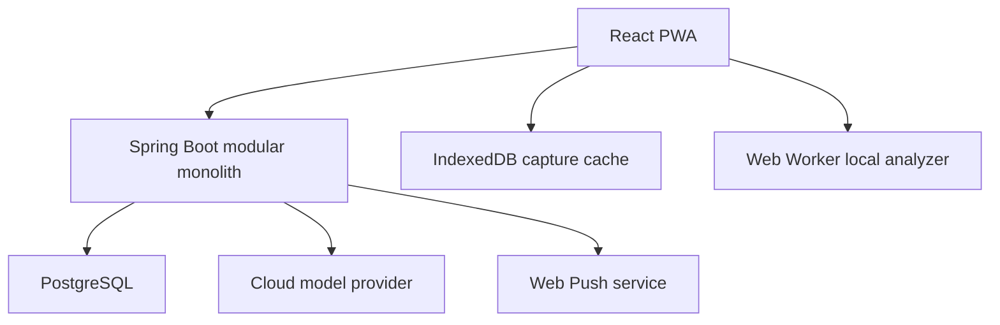

# Architecture

## Architecture style

Use a modular monolith for the backend and a mobile-first PWA for the client.

Do not introduce Neo4j, Kafka, Redis, a separate AI microservice, or a second search service in the MVP. PostgreSQL, a bounded background worker, and clear module boundaries are sufficient.



## Data authority

- The server database is canonical in the MVP.
- The client creates a UUID/client mutation id and writes a pending capture record locally before sending, so a transient network failure does not erase typed text.
- Full bidirectional offline editing and conflict resolution are P1.
- Analysis is always bound to an immutable memo revision.

## Frontend

Recommended structure:

```text
frontend/src/
├─ app/
├─ features/
│  ├─ capture/
│  ├─ analysis-review/
│  ├─ graph/
│  ├─ tasks/
│  ├─ tags/
│  ├─ search/
│  ├─ sync/
│  └─ settings/
├─ workers/
│  └─ analyzer.worker.ts
└─ shared/
   ├─ api/
   ├─ db/
   ├─ schemas/
   └─ ui/
```

### Client responsibilities

- fast raw capture and local pending state
- analysis review and selection
- graph visualization and bounded expansion
- task/search views
- on-device deterministic/model analysis in a worker
- optimistic UI with idempotent server synchronization
- Web Push subscription management

### Client non-responsibilities

- authoritative permission decisions
- direct cloud-provider calls
- canonical tag merge/split
- reminder scheduling authority
- applying raw model output directly to domain state

The local model must be lazily downloaded and excluded from the initial JavaScript bundle. Runtime fallback order is:

```text
WebGPU-capable local analyzer
→ WASM/lighter local analyzer
→ cloud analysis
→ pending unclassified memo
```

## Backend modules

Organize by feature rather than a repository-wide controller/service/repository split.

```text
backend/.../
├─ identity/
├─ memo/
├─ analysis/
├─ taxonomy/
├─ graph/
├─ task/
├─ reminder/
├─ search/
├─ sync/
├─ audit/
└─ common/
```

Each module may contain `api`, `application`, `domain`, and `infrastructure` packages when useful.

### Module responsibilities

- `identity`: authentication, settings, ownership and consent
- `memo`: source revisions, soft delete, restore and idempotent capture
- `analysis`: local validation, ambiguity routing, cloud orchestration and stale-result handling
- `taxonomy`: tags, aliases, provisional topics, centroids and taxonomy proposals
- `graph`: bounded graph projections, activity scoring and reversible clusters
- `task`: derived task/event records and state transitions
- `reminder`: schedule, Web Push and retry
- `search`: lexical/semantic retrieval and cloud context preparation
- `sync`: client mutation handling and later cursor synchronization
- `audit`: provenance, analysis applications and undo

## Cloud Agent orchestration

The default cloud path should be one prepared request rather than an unconstrained autonomous loop.

```text
backend keyword/tag retrieval
→ top-k candidate context
→ one structured model call
→ optional 1–2 read-only tool calls for unresolved references
→ JSON Schema validation
→ domain validation
→ review proposal
```

Hide the provider SDK behind an interface such as `CloudAnalysisGateway`. Spring AI may be used inside an adapter, but domain and application code must not depend on a specific provider.

## Background jobs

Use a PostgreSQL-backed job/outbox table and bounded Spring workers. For concurrent consumers, claim work with a safe locking pattern such as `FOR UPDATE SKIP LOCKED`.

Initial/P1 jobs:

- cloud analysis
- reminder dispatch and retry
- tag centroid update
- provisional topic maintenance
- old-node cluster projection
- stale-model gradual re-embedding
- delayed physical deletion after retention

PWA background execution is not reliable enough to own reminders or taxonomy maintenance. The server owns these tasks.

## Search strategy

MVP:

- exact and normalized text search
- canonical tag/alias lookup
- `pg_trgm` for fuzzy matching where useful
- task/date/status filters

P1:

- versioned embeddings and vector retrieval
- hybrid ranking of lexical and semantic candidates

Do not deploy a dedicated Korean search cluster until measured requirements justify it.

## Graph projection

The graph API projects domain data into view DTOs.

MVP visible node kinds:

- `MEMO`
- `TAG`

MVP edge kinds:

- `MEMO_TAG`
- optional confirmed `MEMO_RELATED_TO_MEMO`
- optional confirmed `TAG_RELATED_TO_TAG`

Task/event/information type is metadata and styling on a memo, not a universal type node. This prevents giant `TASK` and `INFORMATION` hubs.

The home query is bounded and ranks nodes using recency, pin, unfinished status, due proximity, access frequency, and connectivity. It must never default to the full corpus.

## Security boundary

- Deployed traffic uses HTTPS.
- Prefer secure HttpOnly/SameSite cookies for web authentication unless an ADR selects another scheme.
- Apply CSRF protection to cookie-authenticated mutations.
- Every query includes owner scope.
- Cloud secrets remain server-side.
- Memo content is untrusted input.
- Agent tools are allow-listed and read-only before confirmation.
- Model output undergoes JSON Schema and domain validation.
- Logs omit raw memo bodies by default.
- Cloud context is top-k and purpose-limited.

## Observability

Record metrics without recording sensitive text:

- capture latency and error rate
- analysis duration and route
- local/cloud resolution rate
- schema validation failure
- cloud tool count/tokens/cost
- proposal acceptance/correction/rejection
- stale-result rejection
- graph query size and latency
- push delivery/retry/duplicate prevention

Each analysis trace includes memo id, revision, schema version, analyzer/provider version, and correlation id, but not the memo body in ordinary logs.

## Deployment topology

MVP deployment can run as:

```text
static PWA hosting
Spring Boot container
PostgreSQL
```

One backend process may host API and bounded workers initially. Separate them only when measured load or failure isolation requires it.

