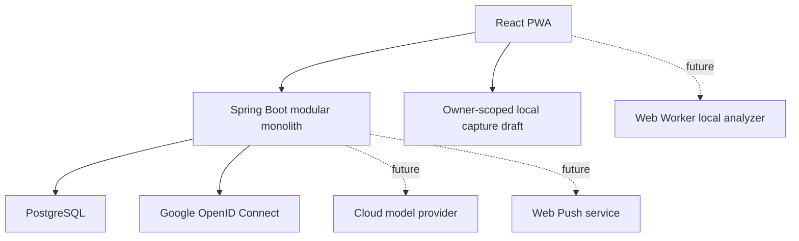

# Architecture

## Architecture style

Use a modular monolith for the backend and a mobile-first PWA for the client.

Do not introduce Neo4j, Kafka, Redis, a separate AI microservice, or a second search service in the
MVP. PostgreSQL and clear module boundaries are sufficient now. V15 uses a bounded in-process
invocation pool to keep gateway work outside database transactions. In the production profile, a
small scheduled worker reuses the same PostgreSQL-backed dispatch state to recover a bounded batch;
it does not add a queue service or a second source of truth.



The PWA and API are exposed through one origin. In personal-PC mode the existing frontend Nginx
terminates private-LAN TLS and proxies every API/OAuth path to an unpublished backend container; a
future server replaces that narrow TLS overlay with its public HTTPS edge. PostgreSQL remains the
canonical portable boundary in both forms. The backend owns authentication redirects, provider
secrets, session state, CSRF validation, and authorization. Google login is capability-gated so the
application still starts and local accounts still work when Google credentials are absent.

The first private account is not an API concern. A fixed non-web command locks a Flyway-owned
singleton row, verifies that no claimed user exists, creates the internal UUID/settings/local
credential, and consumes the gate in one transaction. Password input is attached-console-only and
the browser, model, Agent tools, environment, and command line cannot invoke or supply it.

## Data authority

- The server database is canonical in the MVP.
- The client attempts to preserve an owner-scoped raw capture draft in browser `localStorage`, so
  navigation or a transient network failure need not erase typed text. Automatic cleanup happens
  only after the server confirms memo creation; explicitly clearing the textarea also removes its
  draft. If storage is blocked or full, the UI explicitly warns that the text remains only in the
  current page and activates the unsaved-change guards.
- Local draft storage is not canonical data and is not an offline mutation outbox.
- Raw drafts are scoped by internal owner UUID but are not encrypted at rest. They remain in the
  same browser profile until successful memo creation or explicit text clearing, including after
  logout, so a shared-device policy must account for browser-profile access.
- In-memory proposal edits, pending tag input, and memo revision edits participate in one dirty
  state. OAuth navigation, logout, browser unload, and prompt-based service-worker activation must
  not silently discard that state; navigation is confirmed and update activation is blocked until
  edits are resolved.
- A logout observed from another tab hides and locks, but does not unmount, an already-open dirty
  workspace while the server result is unconfirmed. Receiving tabs probe only with `GET`; marker
  expiry can restore the same mounted owner only after that owner is confirmed.
- Full bidirectional offline editing and conflict resolution are P1.
- Analysis is always bound to an immutable memo revision.

## Frontend

Recommended structure:

```text
frontend/src/
├─ app/
├─ features/
│  ├─ capture/
│  ├─ analysis-review/
│  ├─ graph/
│  ├─ tasks/
│  ├─ tags/
│  ├─ search/
│  ├─ sync/
│  └─ settings/
├─ workers/
│  └─ analyzer.worker.ts
└─ shared/
   ├─ api/
   ├─ db/
   ├─ schemas/
   └─ ui/
```

### Client responsibilities

- bootstrap authentication capability, CSRF, and current-session state before loading owner data
- render local registration/sign-in and the optional Google sign-in/link actions
- fast raw capture and local pending state
- analysis review and selection
- graph visualization and bounded expansion
- task/search views
- future on-device deterministic/model analysis in a worker (not implemented)
- current online mutation UX with idempotent server requests; a full synchronization outbox is P1
- future Web Push subscription management (not implemented)

### Client non-responsibilities

- authoritative permission decisions
- storing passwords, session identifiers, OAuth authorization codes, or provider tokens
- direct cloud-provider calls
- canonical tag merge/split
- reminder scheduling authority
- applying raw model output directly to domain state

No local model is currently downloaded or executed. A future approved local-model slice must keep it
out of the initial JavaScript bundle and may use this fallback order:

```text
WebGPU-capable local analyzer
→ WASM/lighter local analyzer
→ cloud analysis
→ pending unclassified memo
```

## Backend modules

Organize by feature rather than a repository-wide controller/service/repository split.

```text
backend/.../
├─ auth/
├─ memo/
├─ analysis/
├─ taxonomy/
├─ graph/
├─ task/
├─ reminder/
├─ search/
├─ sync/
├─ audit/
└─ common/
```

Each module may contain `api`, `application`, `domain`, and `infrastructure` packages when useful.

### Module responsibilities

- `auth`: authentication, identity linking, settings, ownership and consent
- `memo`: source revisions, soft delete, restore and idempotent capture
- `analysis`: local validation, ambiguity routing, cloud orchestration and stale-result handling
- `taxonomy`: tags, aliases, provisional topics, centroids and taxonomy proposals
- `graph`: bounded graph projections, activity scoring and reversible clusters
- `task`: derived task/event records and state transitions
- `reminder`: schedule, Web Push and retry
- `search`: lexical/semantic retrieval and cloud context preparation
- `sync`: client mutation handling and later cursor synchronization
- `audit`: provenance, analysis applications and undo

The analysis contract accepts recoverable proposal schema v1 and current schema v2. Version 2
identifies date candidates and lets a TASK candidate reference one precise due-date candidate; the
review projection never derives that relation from array order. Both shapes remain untrusted JSONB
until the ordinary owner-scoped, idempotent application transaction succeeds. The existing run
schema-version column and proposal JSONB carry this evolution, so no relational migration or
historical JSON rewrite is introduced for the v2 contract.

Proposal reads negotiate only the response representation. A missing
`X-Analysis-Proposal-Schema-Version` header, or value `1`, projects stored v2 JSON to strict v1 in
memory so an installed older PWA remains usable; value `2` preserves the stored version. The server
never upgrades historical v1 JSON, never rewrites the persisted proposal or hash during projection,
and returns `Cache-Control: no-store` plus `Vary` on the schema header.

The apply request's due `timeZone` remains a validated compatibility field, not an authority over
canonical context. Inside the application transaction the backend replaces it with the locked
immutable memo revision's `source_time_zone` before task persistence. This keeps date-only overdue
semantics tied to capture context even when review happens later on another device or in another
zone.

## Cloud Agent orchestration

The public cloud boundary remains one synchronous request backed by an internal durable state
machine. The production profile also runs a bounded internal recovery loop without exposing an
asynchronous polling contract.

For `CLOUD_ENRICH`, a server-configured adapter first provides one immutable
`CloudGatewayBinding`: a validated `CloudGatewayDescriptor` containing transfer mode and
gateway/provider/model/consent-policy versions plus the executor allowed to run it. A `NO_NETWORK`
adapter needs no user consent. An `EXTERNAL_MEMO_CONTENT` adapter is not called unless the
authenticated owner's setting pins `true`, the exact descriptor policy version, and a non-null grant
time no later than the authorization-check instant. V13 revokes legacy boolean-only grants; a
future-dated grant is also rejected. There is no consent grant/revoke API and no external provider
configured in this checkpoint.

The gateway returns a defensive success proposal or a typed failure enum without provider error
text. Missing consent, typed failure, descriptor/enrichment exception, or invalid enriched output
uses the revalidated local proposal, persists a `HYBRID` / `REVIEW_REQUIRED` run with server-owned
transfer/gateway/provider/model/policy/outcome evidence, and forces detailed UI review. It does not
modify raw or canonical data.

Every new LOCAL, cloud-success, and fallback proposal rebuilds `providerMetadata` from the same
bounded server allow-list; success output cannot preserve arbitrary provider fields. V14 carries the
descriptor, accepted authorization values, and a deterministic opaque request token in the internal
gateway request, while the request/token string and log representations are redacted, and stores the
same final evidence on the run. Existing pre-V14 rows remain `legacy-v0`; these values are not part
of any HTTP/proposal/metadata contract.

V15 commits the call-ready run and `analysis_run_dispatches` preparation before gateway execution.
The run is initially `QUEUED` with `PENDING` cloud evidence; the dispatch is `PREPARED` with the
reserved proposal identity, validated-local payload and hash, deterministic descriptor/executor
binding ID, timeout, maximum attempts, and deadline. A claim transaction rechecks revision,
consent, and binding, then marks the run and dispatch `RUNNING` with a new fence and lease. The
bounded executor runs outside the database transaction, and a final transaction accepts only the
current fence, rechecks the memo revision, persists one final proposal, and scrubs the prepared
payload. Historical runs are not assigned invented dispatch rows.

The HTTP request remains synchronous and normally returns only after the run reaches
`REVIEW_REQUIRED`; an intervening edit or trash operation commits the final run as `STALE` before
returning `409 STALE_MEMO_REVISION`. If a same-key live lease or invocation outlasts the coordination
window, the caller receives `409 ANALYSIS_IN_PROGRESS` and may retry the identical key/body. That
caller-driven recovery remains available.

The production profile additionally enables a scheduler with a 30-second initial/fixed delay and a
25-row batch bound. Its database query selects only `PREPARED` or `RUNNING` rows whose lease has
expired, with owner and the existing raw idempotency key supplied by owner-consistent joins. Each
candidate then enters the existing owner + operation + raw-key advisory transaction lock and the
same V15 claim path. Live leases are skipped, including a lease made live between selection and
claim. A process restart therefore resumes remaining eligible rows on a later bounded cycle. Any
re-execution stays within the persisted attempt/deadline limits and reuses the same provider-request
token. This is bounded at-least-once execution, so an eventual external provider must deduplicate by
that token. Raw recovery keys, dispatch payloads, tokens, bindings, fences, leases, and queued/running
state remain internal and are not added to public DTOs, proposal metadata, recovery responses, or
ordinary logs.

A stale revision detected before execution records `CANCELLED_STALE`. A revision that becomes stale
while a claimed call is in flight preserves that attempt's bounded outcome when finalization marks
the run `STALE`; neither branch applies canonical data.

The following retrieval/tool flow is a future design and is not implemented:

```text
backend keyword/tag retrieval
→ top-k candidate context
→ one structured model call
→ optional 1–2 read-only tool calls for unresolved references
→ JSON Schema validation
→ domain validation
→ review proposal
```

Provider SDKs remain behind `CloudAnalysisGateway`. No SDK or credential is configured today; a
future adapter may use Spring AI internally, but domain and application code must not depend on a
specific provider.

## Background jobs

Cloud-analysis recovery has one narrow background job. It is enabled only in the `prod` profile and
scans at most 25 eligible dispatches every 30 seconds. The scan is database-backed and owner-explicit;
it does not depend on an HTTP security context. The existing idempotency advisory lock, binding
check, lease/fence/deadline bounds, out-of-transaction Fake invocation, and revision-rechecking
finalize are reused rather than duplicated. A process-local guard also prevents overlapping cycles
within one application instance. This is recovery of already prepared work, not a general-purpose
queue, and caller-driven same-key recovery remains supported. Per-attempt history and
duration/model-token/cost observability do not exist.

Other autonomous-processing work remains future design. If it is approved, use PostgreSQL-backed
bounded Spring workers rather than a new infrastructure service; concurrent consumers need a safe
claiming pattern coordinated with the existing advisory lock and lease.

Initial/P1 jobs:

- cloud analysis
- reminder dispatch and retry
- tag centroid update
- provisional topic maintenance
- old-node cluster projection
- stale-model gradual re-embedding
- delayed physical deletion after retention

PWA background execution is not reliable enough to own reminders or taxonomy maintenance. The server owns these tasks.

## Search strategy

MVP:

- exact and normalized text search
- canonical tag/alias lookup
- `pg_trgm` for fuzzy matching where useful
- task/date/status filters

P1:

- versioned embeddings and vector retrieval
- hybrid ranking of lexical and semantic candidates

Do not deploy a dedicated Korean search cluster until measured requirements justify it.

## Graph projection

The graph API projects domain data into view DTOs.

MVP visible node kinds:

- `MEMO`
- `TAG`

MVP edge kinds:

- `MEMO_TAG`
- optional confirmed `MEMO_RELATED_TO_MEMO`
- optional confirmed `TAG_RELATED_TO_TAG`

Task/event/information type is metadata and styling on a memo, not a universal type node. This prevents giant `TASK` and `INFORMATION` hubs.

The home query is bounded and ranks nodes using recency, pin, unfinished status, due proximity, access frequency, and connectivity. It must never default to the full corpus.

## Security boundary

- Deployed traffic uses HTTPS.
- Spring Security authenticates local credentials and Google OpenID Connect, then establishes the same server-side session shape for both methods.
- PostgreSQL-backed Spring Session records are authoritative and revocable. The browser receives only a Secure, HttpOnly, explicitly SameSite session cookie in deployed environments.
- Apply CSRF protection to every cookie-authenticated mutation. The SPA fetches the current token from the backend and sends it in the declared request header.
- Successful authentication rotates the session; sign-out invalidates it.
- Google identities are keyed by `(provider, subject)`. Linking requires an authenticated session and explicit link intent; reported-email equality never performs an implicit merge.
- Passwords use Spring Security's delegating adaptive encoder and are never logged or returned.
- Every domain query and mutation obtains the owner UUID from `SecurityContext`; request DTOs cannot choose an owner.
- Auth and API responses are not cached by the service worker, and no authentication material is persisted in browser storage.
- Cloud secrets remain server-side.
- Memo content is untrusted input.
- The current Fake gateway has no Agent tools. Any future Agent tools must be allow-listed and
  read-only before confirmation.
- Model output undergoes JSON Schema and domain validation.
- Logs omit raw memo bodies by default.
- Future cloud context must be top-k and purpose-limited; top-k retrieval is not implemented.

The current authentication slice is not yet a public-account hardening release. Same-account failures receive a bounded lock, but local email verification, password-reset delivery, IP/edge rate limiting and abuse protection, MFA/passkeys, and complete account deletion remain follow-up work.

## Observability

The current database records route/proposal status, analyzer provenance, V13 cloud
transfer/gateway/provider/model/policy/outcome evidence, V14 internal execution-contract,
authorization/grant snapshot and request-token evidence, and V15 dispatch state, fence count, latest
attempt start, lease, deadline, and finalization time. These internal values are deliberately absent
from public DTOs and proposal metadata. The owner-scoped review summary exposes only bounded
aggregate selection evidence. The dispatch row is not per-attempt history and does not record
analysis duration, model token usage, cost, or provider error text.

Future observability may record the following without recording sensitive text:

- capture latency and error rate
- analysis duration and route
- local/cloud resolution rate
- schema validation failure
- cloud tool count/tokens/cost
- proposal acceptance/correction/rejection
- stale-result rejection
- graph query size and latency
- push delivery/retry/duplicate prevention

Current analysis rows include memo id/revision, schema and analyzer provenance, and cloud evidence,
but there is no separate tracing/correlation subsystem. Ordinary logs must not include the memo body,
provider errors, credentials, or tokens.

## Deployment topology

MVP deployment can run as:

```text
one HTTPS origin / reverse proxy
React PWA static assets + Spring Boot API
PostgreSQL
Google OpenID Connect (optional external identity provider)
```

One backend process hosts the API and authentication endpoints and the current bounded gateway
invocation pool. If autonomous background work is approved, the same process may also host its
database-backed consumers initially; separate them only when measured load or failure isolation
requires it. Redis is not needed: session state remains in PostgreSQL for this stage.
