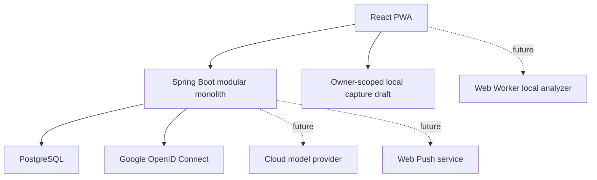

# Architecture

## Architecture style

Use a modular monolith for the backend and a mobile-first PWA for the client.

Do not introduce Neo4j, Kafka, Redis, a separate AI microservice, or a second search service in the
MVP. PostgreSQL and clear module boundaries are sufficient now. V15 uses a bounded in-process
invocation pool to keep gateway work outside database transactions, V16 stores its bounded tag
context snapshot in the same dispatch row, and V17 stores fence-scoped attempt evidence in a child
ledger. In the production profile, a small scheduled worker
reuses that PostgreSQL-backed state to recover a bounded batch; it does not add a queue service or a
second source of truth.



The PWA and API are exposed through one origin. In personal-PC mode the existing frontend Nginx
terminates private-LAN TLS and proxies every API/OAuth path to an unpublished backend container; a
future server replaces that narrow TLS overlay with its public HTTPS edge. PostgreSQL remains the
canonical portable boundary in both forms. The backend owns authentication redirects, provider
secrets, session state, CSRF validation, and authorization. Google login is capability-gated so the
application still starts and local accounts still work when Google credentials are absent.

The first private account is not an API concern. A fixed non-web command locks a Flyway-owned
singleton row, verifies that no claimed user exists, creates the internal UUID/settings/local
credential, and consumes the gate in one transaction. Password input is attached-console-only and
the browser, model, Agent tools, environment, and command line cannot invoke or supply it.

This topology defines the private-beta boundary only for one operator-provisioned owner on a
trusted RFC1918 LAN, online-only, behind local-CA HTTPS with no public port forwarding. Registration
and private-overlay Google authentication stay disabled; backend and PostgreSQL ports stay
unpublished. The application default is deterministic-first and invokes a gateway only for
incomplete coverage. The explicitly configured personal overlay instead uses `AI_PREFERRED` and
sends every validated current revision to the pinned machine-local model. Multi-user or internet-facing
beta requires a new architecture/deployment decision and the public-account/edge controls below.

## Data authority

- The server database is canonical in the MVP.
- The client attempts to preserve an owner-scoped raw capture draft in browser `localStorage`, so
  navigation or a transient network failure need not erase typed text. Automatic cleanup happens
  only after the server confirms memo creation; explicitly clearing the textarea also removes its
  draft. If storage is blocked or full, the UI explicitly warns that the text remains only in the
  current page and activates the unsaved-change guards.
- Local draft storage is not canonical data and is not an offline mutation outbox.
- Raw drafts are scoped by internal owner UUID but are not encrypted at rest. They remain in the
  same browser profile until successful memo creation or explicit text clearing, including after
  logout, so a shared-device policy must account for browser-profile access.
- In-memory proposal edits, pending tag input, and memo revision edits participate in one dirty
  state. OAuth navigation, logout, browser unload, and prompt-based service-worker activation must
  not silently discard that state; navigation is confirmed and update activation is blocked until
  edits are resolved.
- A logout observed from another tab hides and locks, but does not unmount, an already-open dirty
  workspace while the server result is unconfirmed. Receiving tabs probe only with `GET`; marker
  expiry can restore the same mounted owner only after that owner is confirmed.
- Full bidirectional offline editing and conflict resolution are P1.
- Analysis is always bound to an immutable memo revision.

## Frontend

Recommended structure:

```text
frontend/src/
├─ app/
├─ features/
│  ├─ capture/
│  ├─ analysis-review/
│  ├─ graph/
│  ├─ tasks/
│  ├─ events/
│  ├─ tags/
│  ├─ search/
│  ├─ sync/
│  └─ settings/
├─ workers/
│  └─ analyzer.worker.ts
└─ shared/
   ├─ api/
   ├─ db/
   ├─ schemas/
   └─ ui/
```

### Client responsibilities

- bootstrap authentication capability, CSRF, and current-session state before loading owner data
- render local registration/sign-in and the optional Google sign-in/link actions
- fast raw capture and local pending state
- analysis review and selection
- graph visualization and bounded expansion
- task/search views and the bounded confirmed-schedule event list
- explicit EVENT schedule review; start unscheduled and require a user choice before Apply
- future on-device deterministic/model analysis in a worker (not implemented)
- current online mutation UX with idempotent server requests; a full synchronization outbox is P1
- future Web Push subscription management (not implemented)

### Client non-responsibilities

- authoritative permission decisions
- storing passwords, session identifiers, OAuth authorization codes, or provider tokens
- direct cloud-provider calls
- canonical tag merge/split
- reminder scheduling authority
- applying raw model output directly to domain state

No model is downloaded to or executed by the browser. The personal overlay may reach an already
installed Windows Ollama model through the machine-local Docker host bridge; it stays out of the
JavaScript bundle. The client-side fallback order remains a future option:

```text
WebGPU-capable local analyzer
→ WASM/lighter local analyzer
→ cloud analysis
→ pending unclassified memo
```

## Backend modules

Organize by feature rather than a repository-wide controller/service/repository split.

```text
backend/.../
├─ auth/
├─ memo/
├─ analysis/
├─ taxonomy/
├─ graph/
├─ task/
├─ event/
├─ reminder/
├─ search/
├─ sync/
├─ audit/
└─ common/
```

Each module may contain `api`, `application`, `domain`, and `infrastructure` packages when useful.

### Module responsibilities

- `auth`: authentication, identity linking, settings, ownership and consent
- `memo`: source revisions, soft delete, restore and idempotent capture
- `analysis`: local validation, ambiguity routing, cloud orchestration and stale-result handling
- `taxonomy`: tags, aliases, provisional topics, centroids and taxonomy proposals
- `graph`: bounded canonical home projection, hard-priority selection, full-corpus 1-hop pagination,
  and owner-scoped detail navigation
- `task`: derived TASK records and state transitions
- `event`: canonical EVENT schedule persistence and bounded owner-scoped read projection
- `reminder`: schedule, Web Push and retry
- `search`: owner-scoped exact lexical memo retrieval; future fuzzy/semantic retrieval remains
  outside the current slice
- `sync`: client mutation handling and later cursor synchronization
- `audit`: provenance, analysis applications and undo

The analysis contract accepts recoverable proposal schema v1/v2 plus dark-compatible maximum v3.
Version 2 identifies date candidates and lets a TASK candidate reference one precise due-date
candidate. Version 3 additionally represents bounded per-EVENT schedule alternatives through IDs,
explicit timed/all-day intent, optional end, and explicit all-day inclusive/exclusive end semantics.
No relation is derived from array order. Every shape remains untrusted JSONB until the ordinary
owner-scoped, idempotent application transaction succeeds. The existing run schema-version column
and proposal JSONB carry this evolution, so no relational migration or historical JSON rewrite is
introduced for the proposal contract.

Current `fake-v10` / `korean-rules-v8` keeps proposal schema v2 and resolves an explicit
`오늘|내일|모레 + 오전|오후 + 1–12시` phrase (optional minutes) against the immutable revision
capture instant/source zone as `RELATIVE_EXACT`. It also resolves the date-less explicit clock family
with no particle or `에`: bare 1–12시 with optional minutes, explicit 오전/오후, Korean 24-hour clock,
and `HH:mm`. It derives local occurrences on the revision's capture date, retains only instants
strictly after capture, and proposes the earliest safe occurrence. Equality is not future. A DST-gap
occurrence is discarded and a later unique same-day occurrence may be used; any future overlap
occurrence fails the whole expression closed as `UNKNOWN`. No safe remaining occurrence or a
missing/invalid source zone also remains `UNKNOWN`; the rule never rolls forward to tomorrow.

This deterministic value is still untrusted proposal data. The existing owner-scoped manual Apply
is the only canonical mutation boundary, and the rule does not create or deliver an alarm/reminder.

Proposal reads negotiate only the response representation. A missing
`X-Analysis-Proposal-Schema-Version` header, or value `1`, projects any higher stored version to
strict v1 in memory so an installed older PWA remains usable. Value `2` removes v3 EVENT fields but
preserves v2 date IDs/TASK due references; value `3` preserves any supported stored version. The
server never synthesizes an upgrade, never rewrites the persisted proposal or hash during
projection, and returns `Cache-Control: no-store` plus `Vary` on the schema header.

The apply request's due and EVENT schedule `timeZone` fields remain validated compatibility fields,
not authorities over canonical context. Inside the application transaction the backend replaces
them with the locked immutable memo revision's `source_time_zone` before task/event persistence.
This keeps date-only overdue and displayed event context tied to capture context even when review
happens later on another device or in another zone. The timed EVENT validator requires each explicit
offset to be valid for its local date-time in that immutable source zone. It rejects DST gaps and
accepts either explicitly chosen valid offset during an overlap.

Relation application follows the same untrusted-proposal boundary. A no-store owner-scoped read
resolves only bounded display labels for the stored relation array; it does not grant authority.
The mutation accepts proposal array indexes rather than client-supplied target/type/score values,
maps each exact opaque source candidate identity to one selected item, locks every owner-owned
ACTIVE target in deterministic order, and writes directed item-to-MEMO/TAG rows in the application
transaction. An explicit empty relation selection is valid partial application. A legacy omission
is accepted only for a proposal with no relation candidates. Undo deletes the application's
relation rows before source items and never deletes target memos or tags still referenced by another
application.

## Canonical EVENT schedule boundary

Milestone 6A.1 keeps proposal schema v2 unchanged. That proposal can identify precise date
candidates and bind one to TASK due, but it does not carry an EVENT temporal binding. The PWA
therefore initializes every EVENT review item with no schedule. A user may explicitly reuse a
precise `DATE_ONLY`, `EXACT_TIME`, or `RELATIVE_EXACT` candidate as a convenience or enter a schedule
directly. The review layer never associates EVENT and date by array order, and an unscheduled
title-only EVENT remains a valid confirmed item.

When the reviewed Apply includes an EVENT schedule, `selectionSchemaVersion: "2"` is required. The
domain boundary accepts either a whole-second timed offset start with an optional later end or an all-day date
with an optional later exclusive end. It rejects schedule-on-non-EVENT and due-on-non-TASK shapes.
The existing owner/revision lock, idempotency record, application transaction, and undo unit remain
authoritative; model/provider output cannot call Apply.

V21 stores that explicit selection in canonical `event_details`, separate from `task_details`. The
owner-and-kind composite foreign key requires the source item to be the same owner's EVENT, while
`coalesce(..., FALSE)` temporal-shape/range checks reject malformed SQL-null combinations. There is
no backfill, so existing title-only EVENT rows have no detail row and no invented start/end.

`GET /api/v1/events` is a `no-store`, bounded read projection over `event_details`, current active
memos, unarchived current-revision EVENT items, and `APPLIED` applications. It exposes only the item
identity, title, schedule shape, and canonical source zone. Raw memo, proposal, selection,
application/memo provenance, foreign-owner rows, stale revisions, undone/archived/trashed items, and
unscheduled EVENTs remain outside the response.

Milestone 6B adds a second projection over the same query, not another source of truth.
`GET /api/v1/events/calendar.ics` probes at most 101 rows, rejects a partial export above 100, and
returns 204 when there is no RFC component to emit. The pure serializer produces a maximum 128 KiB
UTF-8/CRLF RFC 5545 snapshot with stable opaque non-UUID UIDs, immutable item-creation DTSTAMP,
sequence 0, UTC TIMED values, `VALUE=DATE` ALL_DAY values, explicit ends only, RFC TEXT escaping, and
75-octet folding. Unsafe control text, malformed Unicode, fractional schedule seconds, or out-of-range
years fail closed.

The PWA does not navigate to the API. Its ordinary owner/session-epoch request boundary reads one
no-store Blob, renders only plain text, and downloads those exact bytes through a short-lived object
URL. The service worker remains network-only for the route. The projection contains no raw memo,
TASK, taxonomy, relation, AI/application evidence, internal UUID, alarm, recurrence, or share token,
and executing it performs no canonical write.

Milestone 6C adds a separate calendar-feed module rather than widening `EventService`.
Its authenticated management side derives owner identity from the session and applies CSRF,
expected-owner and idempotency guards to every mutation; update/rotate/external-publication-enable/
revoke/add/remove of an existing feed additionally use optimistic versioning, while create has no
pre-existing version. A client-generated 32-byte secret reaches only create/rotate/
external-publication-enable input; the service stores a domain-separated SHA-256 verifier and returns
metadata-only responses. Explicit feed entries persist
a recipient-only random public UID, sequence, last approved temporal shape, and ACTIVE/CANCELLED
state. Canonical memo edit/trash and application undo update that projection before their source
mutation; restore never reshares automatically. The owner is capped at 100 lifetime feeds including
revoked rows, and each feed at 100 lifetime entries including cancellation tombstones; 6C provides no
delete or capacity-reclamation path.

The publication side is a different dependency direction. A first-order stateless security chain
handles only `GET|HEAD /calendar/v1/feed.ics?token=...`, computes a verifier, derives feed/owner solely
from the matched server row, checks its explicit publication scope against the deployment mode and
current consent policy, and never calls `CurrentIdentity`, creates a session, accepts an owner
header, or writes last-access state. It rechecks current canonical eligibility for ACTIVE rows and
serializes only recipient UID, DTSTAMP/SEQUENCE, explicit temporal values, a disclosure-bounded
SUMMARY, and cancellation status. An impossible ineligible `ACTIVE` projection fails the whole read
as the same generic response instead of producing a partial calendar. Malformed, unknown, rotated,
revoked, disabled-owner, missing/stale consent, deployment/scope mismatch, and projection-integrity
failures have the same empty no-store 404 boundary.
The authenticated 6B serializer and UID remain separate.

These slices remain `SOLO_PROVISIONAL`/`REPORT_ONLY`. The owner-authorized personal stack is now V23
and remains `LOCAL_ONLY`. Its private same-origin proxy may route the fixed feed path without logging
query arguments, but that is not an internet subscription edge. Actual public activation and real
calendar-client validation remain `NOT_AUTHORIZED`.

Milestone 6D.1 implements the source authority-discovery boundary. An authenticated, no-store
`GET /api/v1/calendar-feeds/capabilities` returns the exact discriminated union
`{mode: "LOCAL_ONLY", publicOrigin: null, consentPolicyVersion: null}` or
`{mode: "PUBLIC_HTTPS", publicOrigin: "https://<public-fqdn>[:port]",
consentPolicyVersion: "calendar-feed-public-v1"}`. `LOCAL_ONLY` is the
fail-closed public-publication default. Spring binds disabled/blank properties by default and fails
startup for inconsistent or noncanonical enabled configuration. A `PUBLIC_HTTPS` origin is a maximum
255-character lowercase HTTPS multi-label ASCII hostname with an optional non-default port; userinfo, IP literals,
`localhost` and its subdomains, path, query, fragment, trailing slash, and explicit `:443` are
rejected. This syntactic check proves neither public-suffix ownership nor DNS reachability. The
origin and policy identifier come from server-owned configuration, not browser location, request headers, feed state,
memo content, or caller input.

The PWA strictly decodes all three fields. Only `PUBLIC_HTTPS` uses the returned server origin. A valid
`LOCAL_ONLY` response may deliberately assemble the fixed path from the exact current private/local
HTTP(S) origin, but the UI labels that URL local/isolated and warns against external distribution.
Request failure or a missing/malformed response is not converted to `LOCAL_ONLY` and cannot silently
fall back to private same-origin.

ADR 0015 adds a separate V23 per-feed authority gate. Existing and newly created rows remain
`LOCAL_ONLY` with null consent. An authenticated owner must accept the exact current policy and
supply a fresh client-generated bearer through an idempotent external-publication mutation.
Verifier rotation, `PUBLIC_HTTPS` scope, policy/time pin and one version increment commit together;
the old bearer is never promoted. A deployment switch therefore makes legacy local feeds
unavailable instead of public. Policy drift also closes a public feed until fresh re-consent. A
public feed cannot change disclosure mode through the ordinary update path. Revoke permanently
invalidates the feed and clears its public scope/pin. Membership remains explicit and no future
event is selected automatically.

This 6D.1 backend/property/controller and frontend decoder/UI implementation was first deployed to
the personal V22 stack without publication environment entries. That V22 private smoke verified
health, zero failed migration, the unauthenticated 401/no-store boundary, and synthetic private
GET/HEAD without token logging; it did not use a personal session to execute the authenticated 200
response. The later owner-authorized V23 migration/rebuild completed with the same fail-closed
`LOCAL_ONLY` deployment mode. Public activation, real-client interoperability smoke, alarms/reminders,
recurrence, and external calendar writes remain `NOT_AUTHORIZED`.

### 6D public-edge preflight topology

The source preflight adds a new dependency direction without widening the private frontend:

```text
future reviewed HTTPS operator (not configured or authorized)
                       │
                       ▼
Windows 127.0.0.1:${PERSONAL_MEMO_CALENDAR_EDGE_PORT:-8787}
                       │
             calendar-feed-edge
        exact GET|HEAD feed target only
                       │ private internal network
                       ▼
                  Spring Boot

private PWA/API listener ── not connected to this edge
PostgreSQL               ── not published
```

`compose.public-feed.yaml` creates only the loopback edge and its internal backend network. It leaves
the backend capability at `LOCAL_ONLY`. The edge matches the exact raw canonical-token query target,
accepts no body, forwards no caller credentials/cookies/referer/forwarding headers, and logs only a
fixed safe route/method classification. Local rejection and intercepted upstream errors become a
generic empty 404; rate rejection is bodyless 429. The isolated test topology replaces Spring
Boot/PostgreSQL with a disposable Nginx stub and generated synthetic tokens, so it never enters a
personal data path. The recorded isolated run passed query/path/header/custom-method bearer sentinel
absence from owned edge/upstream logs, which is not external-operator log proof.

The preflight origin hop provisionally enforces 60 requests/minute with burst 20, 8 concurrent
connections, and 2s/5s/10s proxy connect/send/read timeouts. An external tunnel or proxy can make all
clients share one immediate peer at this hop, so these are global containment bounds rather than an
external per-client policy. Their individual timeout semantics do not form a total external deadline
or an end-to-end SLA.

`compose.public-feed-activation.yaml` is intentionally separate and must be the last overlay. Only a
second, separately approved cutover supplies the reviewed `PUBLIC_HTTPS` origin and exact consent
policy version from ignored
`.env.public-feed`. DNS, trusted TLS, operator routing and logs, external limits, and external-client
behavior are outside the overlay. Rollback disables the external route first, recreates the backend
without the activation overlay to restore `LOCAL_ONLY`, and then removes the loopback edge if needed;
there is no database migration or canonical rollback.

## Dark-compatible EVENT temporal-binding boundary

Milestone 6A.2a defines proposal schema v3 without activating a producer. A v3 item carries a
bounded `eventScheduleCandidates` list and nullable `suggestedEventScheduleCandidateId`. Each strict
alternative has a unique ID, explicit mode, a start date-candidate reference, optional end
descriptor, and score. The end descriptor says whether its value is already exclusive or, for
all-day only, names the included final day whose normalized exclusive boundary is the next calendar
day. Missing ends remain missing; inclusive conversion is never inferred from proximity or order.

Schema and domain validation reject dangling/imprecise/mode-incompatible references, duplicate IDs
or semantic alternatives, non-later normalized ranges, overflow, candidates on non-EVENT items, and
multiple alternatives without `CONFLICTING_DATES`. The current domain gate also rejects every
non-null suggestion. Current `fake-v10` and the localhost semantic-patch adapter keep emitting v2.

The PWA can decode and display v3 alternatives but initializes every EVENT schedule to null. A user
must explicitly choose a displayed alternative before it becomes editable, then use the existing
Apply action. Thus v3 display support is not a preselection path and creates no canonical data.
Temporal-candidate-bearing v3 proposals and schedule-bearing selections remain fail-closed
`UNCLASSIFIABLE` in outcome comparison.

A separate strict EVENT label-overlay contract and structural validator contain no checked-in
labels, reviewer manifest, adjudication, metric result, threshold, or `PASS`. Producer activation
requires independent human policy approval, two independent label passes and adjudication, frozen
thresholds chosen before candidate output, a held-out release, source-zone-aware prefill validation,
and a separate product/deployment decision. The existing TASK-due dataset-v3 overlay grants no EVENT
authority.

## Cloud Agent orchestration

The public cloud boundary remains one synchronous request backed by an internal durable state
machine. The production profile also runs a bounded internal recovery loop without exposing an
asynchronous polling contract.

For `CLOUD_ENRICH`, a server-configured adapter first provides one immutable
`CloudGatewayBinding`: a validated `CloudGatewayDescriptor` containing transfer mode and
gateway/provider/model/consent-policy versions plus the executor allowed to run it. A `NO_NETWORK`
adapter needs no user consent. An `EXTERNAL_MEMO_CONTENT` adapter is not called unless the
authenticated owner's setting pins `true`, the exact descriptor policy version, and a non-null grant
time no later than the authorization-check instant. V13 revokes legacy boolean-only grants; a
future-dated grant is also rejected. There is no consent grant/revoke API and no external provider
configured in this checkpoint.

`LOCAL_MACHINE_MEMO_CONTENT` is neither `NO_NETWORK` nor external-cloud consent. Checked-in Compose
enables it only in the personal overlay, while configuration validation independently enforces a
machine-local origin and an exact configured model/digest. That overlay pins
`http://host.docker.internal:11434`, the exact LiquidAI tag/digest, the same exact relay origin, and
a 45-second outer execution timeout. The transport accepts only `/api/tags` and `/api/chat`,
uses a direct client with redirects disabled, exposes no tools, and verifies the installed model both
before and after generation. Current adapter binding `ollama-local-gateway-v2` accepts an optional
bounded textual Ollama `thinking` field only to validate and discard it. The visible `content` must
still pass strict JSON, proposal schema, and domain validation; non-text, oversized, extra-field,
malformed, or truncated responses fail closed. The normal application configuration still selects
the Fake gateway.

Before the first gateway call, the V16 retrieval step examines at most 10 tag proposals and at most
20 distinct normalized canonical-name/alias terms. One owner-scoped SQL query matches only the
authenticated owner's active tags and aliases by exact normalized equality. Unique resolution uses
the complete returned match set. Only then do deterministic ordering and UUID deduplication retain at
most K=8 candidates. The resulting `CloudAnalysisRequest` context is a hint only; final owner/reference
validation remains authoritative. This retrieval step does not read raw memo or related-memo content
and uses no fuzzy search, vector search, or embedding. The later personal local-model execution gets
the current immutable revision only as bounded in-memory input; it is not a retrieval source. The
explicit public-fixture localhost runner remains separate from this architecture path.

The gateway returns a defensive success proposal or a typed failure enum without provider error
text. Missing consent, typed failure, descriptor/enrichment exception, or invalid enriched output
uses the revalidated local proposal, persists a `HYBRID` / `REVIEW_REQUIRED` run with server-owned
transfer/gateway/provider/model/policy/outcome evidence, and forces detailed UI review. It does not
modify raw or canonical data.

The personal model may only select one existing grounded item, a replacement kind, and exact
memo substrings for action/object/time. A deterministic mapper rebuilds and revalidates the full
proposal; it cannot accept model-selected owner, identifiers, title, canonical tags, relations, due
date, tool calls, or mutation. Failure, timeout, wrong model/digest, truncation, protocol/schema/domain
violation, or an unpatchable input ends as a revalidated local detailed-review proposal. A
default-`RECORD` fallback is normalized to `UNKNOWN`; an existing explicit grounded candidate remains.
Its
`num_predict=1024` is a provisional hidden-reasoning budget observed to permit STOP; visible output,
transport response, and proposal byte limits remain separate and lower.

V19 stores only a versioned deterministic decision projection, fallback codes, model contribution
status, and semantic changed-field names. V20 separately stores the versioned invocation mode/reason
so `AI_PREFERRED` never invents semantic ambiguity. V20 may also snapshot at most three offset-only
approved-type anchors for one dispatch; finalization scrubs that snapshot and retains only its
hash/version/count. Historical memo text and selection JSON never enter the model prompt. This is a
bounded inference-time hint, not a RAG corpus, automatic rule update, fine-tune, or LoRA loop.

Every new LOCAL, cloud-success, and fallback proposal rebuilds `providerMetadata` from the same
bounded server allow-list; success output cannot preserve arbitrary provider fields. V14 carries the
descriptor, accepted authorization values, and a deterministic opaque request token in the internal
gateway request, while the request/token string and log representations are redacted, and stores the
same final evidence on the run. Existing pre-V14 rows remain `legacy-v0`; these values are not part
of any HTTP/proposal/metadata contract.

V15 commits the call-ready run and `analysis_run_dispatches` preparation before gateway execution.
The run is initially `QUEUED` with `PENDING` cloud evidence; the dispatch is `PREPARED` with the
reserved proposal identity, validated-local payload and hash, deterministic descriptor/executor
binding ID, timeout, maximum attempts, and deadline. A claim transaction rechecks revision,
consent, and binding, then marks the run and dispatch `RUNNING` with a new fence and lease. The
bounded executor runs outside the database transaction, and a final transaction accepts only the
current fence, rechecks the memo revision, persists one final proposal, and scrubs the prepared
payload. V16 also commits the serialized context, its SHA-256 hash, version, and candidate count
before the call. Claim and recovery decode only that database snapshot and never rerun retrieval, so
the same provider-request token cannot be retried with different context. Finalization scrubs the
serialized context but retains hash/version/count evidence. Existing V15 dispatches remain
`none`/`0`/null raw/null hash and historical runs are not assigned invented dispatch rows.

V17 versions new dispatches as `gateway-attempt-v1` and inserts one owner-scoped
`analysis_run_dispatch_attempts` row for every claimed fence, bounded by the dispatch's
`max_attempts`. Existing dispatches remain `attempt_history_version=none` and receive no invented
history. The ledger separates local termination from remote result truth: executor rejection is
definitively `NOT_STARTED` / `EXECUTOR_REJECTED` with an unknown gateway result, while any returned
gateway result is `STARTED`; a typed `UNAVAILABLE` is therefore an observed result. After submission,
timeout, caller interruption, and unexpected local termination are `STARTED` when start was observed
and otherwise `UNKNOWN`, never definitive `NOT_STARTED`. Those terminations and process loss do not
assert an unobserved provider result. Obsolete-fence completion and stale finalization remain evidence
without authority to overwrite the final run.

For an observed termination, elapsed milliseconds come from a monotonic local clock around executor
submission and waiting; this is not wall-clock or end-to-end user latency. Timeout and interruption
may have measured local duration while remote result truth remains unknown. Process loss has unknown
duration and unknown model-token/cost evidence. Every local termination observation for the
`NO_NETWORK`, model-version `none` Fake is `NOT_APPLICABLE` with null model-token/cost numbers even when
execution start is uncertain; an observation-free process loss remains `UNKNOWN`. For a future
real-model gateway, definitive `NOT_STARTED` is `NOT_APPLICABLE`, an observed result is `NOT_REPORTED`,
and uncertain execution or remote completion is `UNKNOWN`.
The schema validates a future `REPORTED` numeric shape but no current path writes those numbers or
substitutes zero for missing evidence.

The HTTP request remains synchronous and normally returns only after the run reaches
`REVIEW_REQUIRED`; an intervening edit or trash operation commits the final run as `STALE` before
returning `409 STALE_MEMO_REVISION`. If a same-key live lease or invocation outlasts the coordination
window, the caller receives `409 ANALYSIS_IN_PROGRESS` and may retry the identical key/body. That
caller-driven recovery remains available.

The production profile additionally enables a scheduler with a 30-second initial/fixed delay and a
25-row batch bound. Its database query selects only `PREPARED` or `RUNNING` rows whose lease has
expired, with owner and the existing raw idempotency key supplied by owner-consistent joins. Each
candidate then enters the existing owner + operation + raw-key advisory transaction lock and the
same V15/V16/V17 claim path. Live leases are skipped, including a lease made live between selection and
claim. A process restart therefore resumes remaining eligible rows on a later bounded cycle. Any
re-execution stays within the persisted attempt/deadline limits and reuses the same provider-request
token and database context snapshot. This is bounded at-least-once execution, so an eventual external
provider must deduplicate by that token. Raw recovery keys, dispatch payload/context,
context hash/version/count, attempt ledger, tokens, bindings, fences, leases, and queued/running state
remain internal and are not added to public DTOs, proposal JSON or `providerMetadata`, UI, evaluation
reports, recovery responses, ordinary logs, browser storage, or service-worker caches.

A stale revision detected before execution records `CANCELLED_STALE`. A revision that becomes stale
while a claimed call is in flight preserves that attempt's bounded outcome when finalization marks
the run `STALE`; neither branch applies canonical data.

The narrow automatic exact tag/alias lookup above is implemented inside the application and is not a
callable Agent tool. The broader retrieval/tool flow remains future work:

```text
related-memo or fuzzy/vector/embedding retrieval
→ additional bounded candidate context
→ one structured model call
→ optional 1–2 read-only tool calls for unresolved references
→ JSON Schema validation
→ domain validation
→ review proposal
```

Provider SDKs remain behind `CloudAnalysisGateway`. No SDK or credential is configured today; a
future adapter may use Spring AI internally, but domain and application code must not depend on a
specific provider.

## Background jobs

Cloud-analysis recovery has one narrow background job. It is enabled only in the `prod` profile and
scans at most 25 eligible dispatches every 30 seconds. The scan is database-backed and owner-explicit;
it does not depend on an HTTP security context. The existing idempotency advisory lock, binding
check, lease/fence/deadline bounds, out-of-transaction configured-gateway invocation, and revision-rechecking
finalize are reused rather than duplicated. A process-local guard also prevents overlapping cycles
within one application instance. This is recovery of already prepared work, not a general-purpose
queue, and caller-driven same-key recovery remains supported. V17's attempt ledger follows the same
claim/fence state machine; real-model numeric usage/cost collection and budget enforcement do not
exist.

Other autonomous-processing work remains future design. If it is approved, use PostgreSQL-backed
bounded Spring workers rather than a new infrastructure service; concurrent consumers need a safe
claiming pattern coordinated with the existing advisory lock and lease.

Initial/P1 jobs:

- cloud analysis
- reminder dispatch and retry
- tag centroid update
- provisional topic maintenance
- old-node cluster projection
- stale-model gradual re-embedding
- delayed physical deletion after retention

PWA background execution is not reliable enough to own reminders or taxonomy maintenance. The server owns these tasks.

## Search strategy

Current exact lexical slice:

- `POST /api/v1/search/memos` keeps the query in a strict JSON body rather than a URL and applies ordinary
  session, CSRF, and expected-owner protections. It is read-only and creates no idempotency or
  analytics row.
- PostgreSQL reads only the current immutable raw revision for BODY. TITLE comes only from the latest
  valid `APPLIED` selection and may identify an older `canonicalRevision`; proposal JSON and undone
  applications never become search authority.
- The server rejects U+0000 and malformed UTF-16, and bounds both raw and normalized query strings to 200
  UTF-16 code units. Java produces the query operand with NFKC/strip/`Locale.ROOT` lowercase;
  PostgreSQL applies `normalize(..., NFKC)` and `lower(... COLLATE "und-x-icu")` to stored BODY/TITLE
  before literal-substring comparison. These are the implemented two sides of the contract; no
  broader collation equivalence is assumed. SQL wildcard characters are ordinary content.
  TAG/ALIAS use `TagNormalizer` and exact normalized equality against current-owner `ACTIVE`
  canonical data only.
- lifecycle, task state, snapshot-derived overdue, inclusive current-revision lower time, and
  exclusive upper time filters are server-validated. Each revision bound is restricted to the
  inclusive UTC instant range `0001-01-01T00:00:00Z` through
  `9999-12-31T23:59:59.999999Z` before JDBC binding. Result order is current raw-revision time
  descending then memo UUID ascending.
- the server defaults to 20 and rejects pages above 50; the PWA keeps at most five pages/100 results.
  Each result has a maximum 240-code-point current-raw preview and eight active canonical tags.
- cursor version 1 contains hashes and identities, not the query or display content. It is bound to
  the authenticated owner, normalized query, canonical filters, sort shape, 24-hour snapshot, last
  memo, and a digest of the complete visible result membership/order/display state. Continuation
  recomputes that digest in `REPEATABLE_READ`; change returns 422 and requires an explicit first-page
  restart.
- selecting a result reuses the owner-scoped, no-store current raw memo detail. It neither adds a
  React Flow node nor mutates the graph projection.

Measured follow-up only:

- the explicit worst-case all-match 10,000-memo hot-plan observation kept every individual page or
  digest plan below 1.1 seconds with no shared read/temp I/O and showed no reason to add a
  search-specific migration or index; this is not endpoint latency or an SLA
- `pg_trgm` or another fuzzy index only when later representative data/concurrency measurements
  demonstrate a need or the product explicitly adds fuzzy ranking
- related-memo and versioned vector/embedding retrieval after separate product and evaluation gates

The current slice does not introduce a Flyway migration, `pg_trgm`, a search service, a provider,
or fuzzy/semantic ranking. Do not deploy a dedicated Korean search cluster until measured
requirements justify it.

## Graph projection

The graph API projects domain data into view DTOs.

V18's confirmed item-scoped typed relations are canonical data but are not yet graph input. The
current graph exposes only `MEMO_TAG` edges derived from `item_tags`. Promoting an ITEM source to its
memo, merging TAG-target relations with membership edges, mapping four directed relation types, and
deduplicating multiple application provenances all require an explicit edge-semantics and budgeting
decision. Until then relation apply/undo cannot change graph nodes, edges, neighborhoods, or
`projectionVersion`.

MVP visible node kinds:

- `MEMO`
- `TAG`

Current MVP edge kinds:

- `MEMO_TAG`

Deferred graph edge candidates, pending the explicit mapping and budgeting decision above, include
`MEMO_RELATED_TO_MEMO` and `TAG_RELATED_TO_TAG`; they are not emitted by the current API.

Task/event/information type is metadata and styling on a memo, not a universal type node. This prevents giant `TASK` and `INFORMATION` hubs.

The current home query is bounded before it reaches the PWA. Memo candidates use canonical hard
priorities only: pin, overdue, unfinished TODO, nearest TODO due, current raw-revision creation time,
then UUID. Using the raw-revision time prevents a pin toggle or lifecycle metadata update from
masquerading as a recent source edit. Tag candidates use degree within the already selected memo set,
then stable name and UUID ordering. Access-frequency scoring, learned importance, cluster projection,
and persistent layout are not implemented.

When `limit > 1`, the projection reserves `max(1, floor(limit / 5))` slots for tag nodes before
selecting memos. It retains only the slots used by actual selected tags, safely backfills the rest
with the next memo candidates, and recomputes tag rank and truncation over that final memo set. When
tags exist only beyond the initial memo set, it underfills instead of claiming an unexamined relation
set is complete. A one-node request still probes for an omitted tag. Omitted memo or tag candidates
set `truncated=true`.

React Flow owns only the bounded display layout. A node button highlights direct neighbors already in
the current projection and opens an accessible mobile drawer. The drawer then calls a separate
owner-scoped, no-store full-corpus endpoint for one canonical `MEMO_TAG` hop. MEMO→TAG pages use
normalized tag name/UUID order; TAG→MEMO pages reuse the home pin/overdue/TODO/due/current-revision/UUID
priority. Each page is bounded to 20. Cursor v2 freezes time-derived overdue at `snapshotAsOf` for at
most 24 hours and carries identities plus an opaque SHA-256 digest of the first page's complete visible
center/neighborhood membership, ordering inputs, and node fields. A continuation recomputes that
digest inside its owner-scoped `REPEATABLE_READ` transaction and returns `INVALID_GRAPH_CURSOR` when
canonical state changed, preventing mutable priority keys from silently skipping or duplicating a
neighbor. Center availability is verified before cursor parsing, so the cursor never grants access.

The PWA keeps at most five pages/100 neighbors in one drawer. A tag neighbor can open the existing
no-store current memo detail even when that memo is outside the home projection; it is not injected
into React Flow. Independent abort/generation guards prevent stale page or raw-detail responses from
replacing the current root. A stale cursor keeps the accumulated list visibly stale, hides further
pagination, and offers an explicit first-page restart. This completes the first read-only Milestone 5
neighborhood slice without making that endpoint a search API or claiming alias detail, taxonomy
evolution, or graph compression. The separate exact lexical slice below still does not claim fuzzy
or semantic retrieval.

Exact lexical search is a separate projection over the same canonical tables. It can find a memo
outside graph home and open the same current raw detail, but it does not expand a graph neighborhood
or make search state part of the graph source of truth. A stale search cursor preserves the visible
result list only as an explicitly stale UI snapshot until the user restarts at page one.

## Security boundary

- Deployed traffic uses HTTPS.
- Spring Security authenticates local credentials and Google OpenID Connect, then establishes the same server-side session shape for both methods.
- PostgreSQL-backed Spring Session records are authoritative and revocable. The browser receives only a Secure, HttpOnly, explicitly SameSite session cookie in deployed environments.
- Apply CSRF protection to every cookie-authenticated mutation. The SPA fetches the current token from the backend and sends it in the declared request header.
- Successful authentication rotates the session; sign-out invalidates it.
- Google identities are keyed by `(provider, subject)`. Linking requires an authenticated session and explicit link intent; reported-email equality never performs an implicit merge.
- Passwords use Spring Security's delegating adaptive encoder and are never logged or returned.
- Every domain query and mutation obtains the owner UUID from `SecurityContext`; request DTOs cannot choose an owner.
- EVENT Apply uses the same owner/revision/idempotency/CSRF boundary as other confirmed data, and
  schedule readback is owner-scoped and `no-store`.
- Auth and API responses are not cached by the service worker, and no authentication material is persisted in browser storage.
- Cloud secrets remain server-side.
- Memo content is untrusted input.
- The current Fake gateway has no Agent tools. Any future Agent tools must be allow-listed and
  read-only before confirmation.
- Model output undergoes JSON Schema and domain validation.
- Logs omit raw memo bodies by default.
- Production Nginx access logs use an explicit allow-list format. The request target is limited to
  method plus normalized `$uri`; `$request`, `$request_uri`, `$args`, query strings, and Referer are
  absent, so opaque graph cursors and future query terms do not enter edge access logs. Static asset
  access logging remains disabled.
- Current exact tag/alias context is owner-scoped, purpose-limited, and bounded to K=8. It is an
  internal hint, while final owner/reference validation remains authoritative; broader
  related-memo/fuzzy/vector/embedding context is not implemented.

The current authentication slice is not yet a public-account hardening release. Same-account failures receive a bounded lock, but local email verification, password-reset delivery, IP/edge rate limiting and abuse protection, MFA/passkeys, and complete account deletion remain follow-up work.

## Observability

The current database records route/proposal status, analyzer provenance, V13 cloud
transfer/gateway/provider/model/policy/outcome evidence, V14 internal execution-contract,
authorization/grant snapshot and request-token evidence, and V15 dispatch state, fence count, latest
attempt start, lease, deadline, and finalization time. V16 adds bounded retrieval-context hash,
version, and candidate-count evidence and retains serialized context only until finalization. V17
adds owner-scoped fence history, local execution/termination, remote-result state, disposition,
monotonic local duration status, and explicit model-token/cost evidence status. Existing dispatches
stay `none` with no history backfill. These internal values are deliberately absent from public DTOs,
proposal metadata, UI, and evaluation reports. The owner-scoped review summary exposes only bounded
aggregate selection evidence.

Attempt rows contain no provider error text, provider/model identifier, provider-request token, raw
memo, or retrieval context. They remain with the current run data until an approved purge policy is
defined; V17 adds no independent TTL. Public/logging boundaries also remain unchanged, and ordinary
logs do not receive the ledger.

Future observability may record the following without recording sensitive text:

- capture latency and error rate
- end-to-end analysis duration and route
- local/cloud resolution rate
- schema validation failure
- cloud tool count/tokens/cost
- proposal acceptance/correction/rejection
- stale-result rejection
- graph query size and latency
- push delivery/retry/duplicate prevention

Current analysis rows include memo id/revision, schema and analyzer provenance, cloud evidence, the
retained V16 context hash/version/count, and V17 internal attempt evidence, but there is no separate
tracing/correlation subsystem or numeric real-model usage/cost integration.
Ordinary logs must not include the memo body, retrieval context, provider errors, credentials, or
tokens.

## Deployment topology

MVP deployment can run as:

```text
one HTTPS origin / reverse proxy
React PWA static assets + Spring Boot API
PostgreSQL
Google OpenID Connect (optional external identity provider)
```

The private deployment reached V22 on 2026-08-27 after a separately authorized backup, restore
rehearsal, forward migration, rebuild, and private health/unknown-token smoke. That procedure created
or inspected no personal schedule/feed row and exposed no calendar route through a public edge.
The later owner-authorized Milestone 6D.1 rebuild placed the server-owned public-origin API and strict
UI boundary in the personal V22 image with no publication environment, preserving `LOCAL_ONLY` and
leaving the public edge closed. The later 6D public-edge preflight source adds only the isolated
loopback topology described above; no public hostname, DNS/TLS operator, external route, or personal
data verification has been activated.
The subsequent owner-authorized V23 migration/rebuild completed with the personal deployment still
`LOCAL_ONLY`; actual public activation and real calendar-client validation remain `NOT_AUTHORIZED`.

One backend process hosts the API and authentication endpoints and the current bounded gateway
invocation pool. If autonomous background work is approved, the same process may also host its
database-backed consumers initially; separate them only when measured load or failure isolation
requires it. Redis is not needed: session state remains in PostgreSQL for this stage.

## Access-gated owner-only remote topology

ADR 0018 adds a second public topology without widening the calendar edge. Cloudflare terminates TLS
for one exact application hostname, applies an exact-owner Access policy and entire-host cache bypass,
then routes a dedicated named Tunnel to a dedicated Manual Windows connector and
`127.0.0.1:8788`. The connector reaches only an unprivileged `app-public-edge`. That edge shares the
internal `app-publication` network with the frontend. For Windows Docker Desktop host-loopback
publishing it alone also joins the non-internal `app-loopback` bridge; frontend, backend, and
PostgreSQL do not. The bridge's possible outbound reachability is a residual risk, bounded by the
edge's unprivileged/read-only execution, `cap_drop: ALL`, `no-new-privileges`, and fixed frontend
upstream. Backend and PostgreSQL remain unpublished and outside both edge networks.

The edge normalizes Host and forwarded scheme/port, removes caller and Cloudflare identity/network
claims, allow-lists application headers, and reconstructs the Cookie header from only the first
bounded exact `SESSION` and `XSRF-TOKEN` values. `CF_Authorization` and arbitrary cookies are not
forwarded. It preserves only the body/CSRF/idempotency values needed by the existing same-origin
application. Spring session authentication, CSRF, owner derivation,
revision checks, domain/JSON validation, and explicit Apply remain the authority. The edge blocks the
public feed, Actuator, internal paths, registration, Google/OAuth for the initial remote beta, unknown
SPA paths, unsupported methods, and unsafe requests without the exact public Origin. The registration
deny includes Spring-style semicolon matrix parameters. Immutable caching additionally requires both
a fingerprinted asset path and a final `200`/`206`/`304`, so hash-shaped 4xx/5xx responses are
`no-store`.

The private frontend log and outer edge log reduce paths and methods to finite route classes; neither
records client address, raw URI/query, identifiers, cookies, referrer, authorization, or Access JWT.
The calendar and application connectors have separate service names, protected roots, tokens,
metrics ports, readiness checks, and connector-first rollback. Source/local synthetic readiness does
not activate the remote route or authorize Cloudflare processing of personal traffic.
